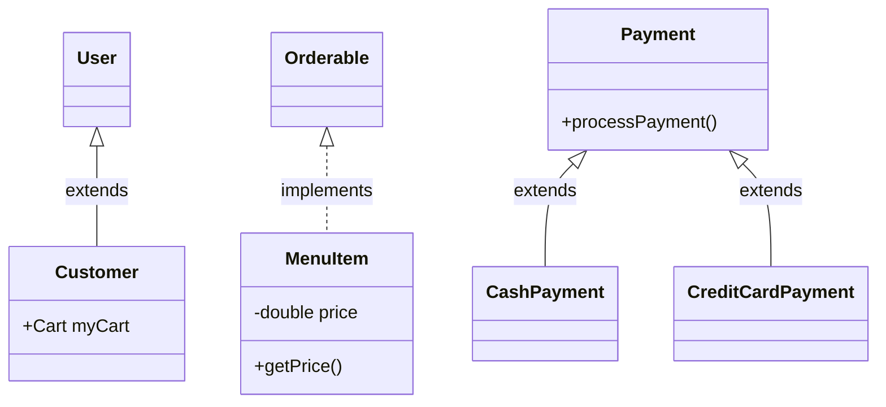

# Project UML Diagrams

## 1. Class Diagram


## 2. Use Case Diagram
```mermaid
useCaseDiagram
    actor Customer
    usecase "View Menu" as UC1
    usecase "Add Items to Cart" as UC2
    usecase "Place Order" as UC3
    usecase "Process Payment" as UC4
    
    Customer --> UC1
    Customer --> UC2
    Customer --> UC3
    Customer --> UC4
```